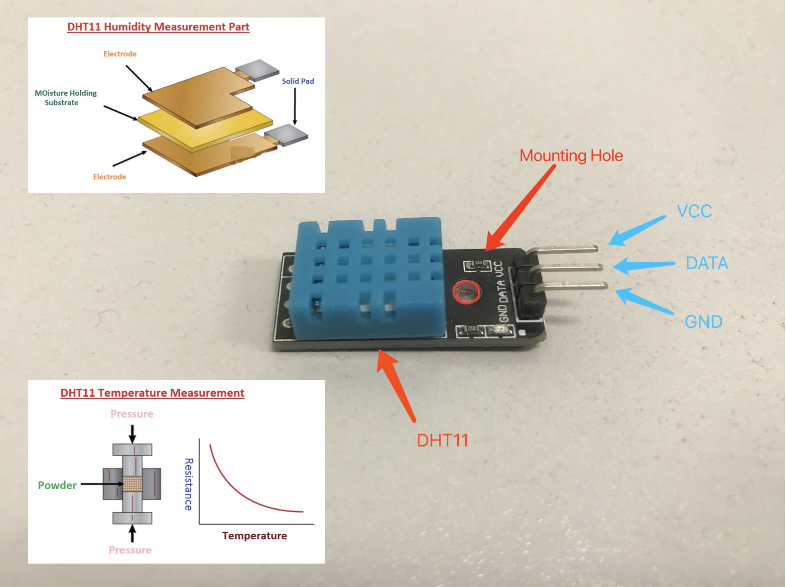
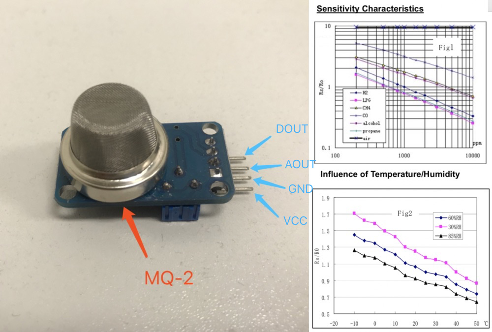
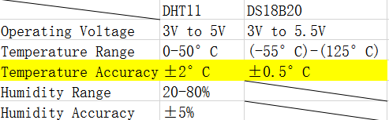
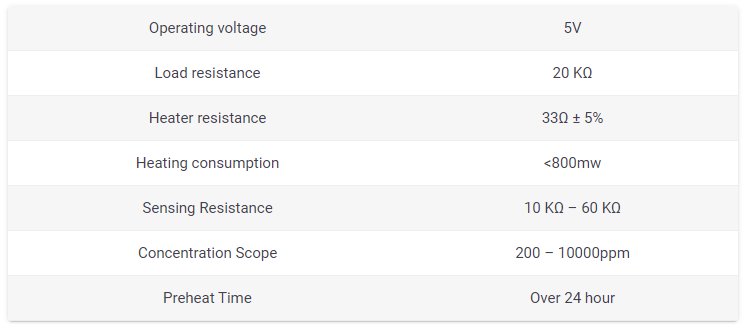
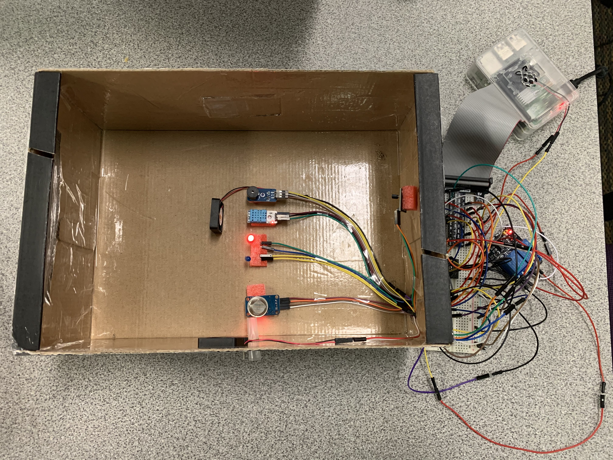
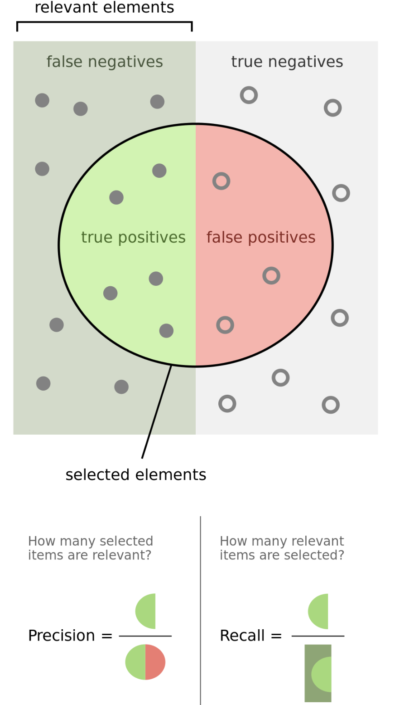
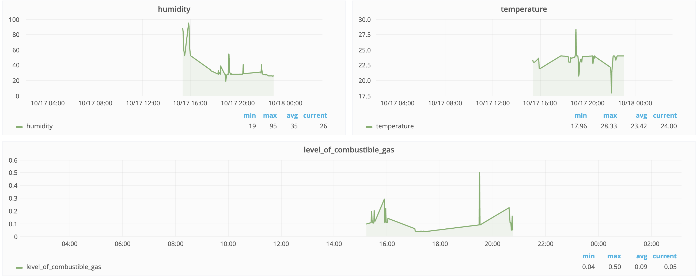
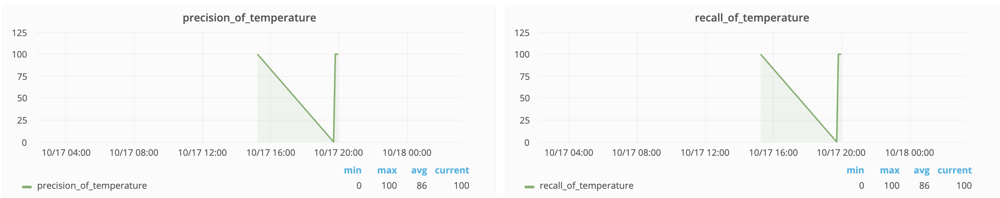

 <body>

  

  <nav class="site-nav">
    <a href="#" class="menu-icon">
      <i class="fa fa-navicon fa-lg"></i>
    </a>

  

      <a class="page-link" href="https://inferlab.github.io/12740"> Course Site</a>
  

  </nav>

  

  

    

      

  <header class="post-header">
     <h1 class="post-title" style="text-align: center">Indoor Air Quality Monitoring System</h1>
     
 Group AA: Yu Du; Yuhang Liang; Lin Lyu

  </header>
  <figure>
  

  
  <figcaption>  Our Team!!  </figcaption>
  

  </figure>

  <article class="post-content">
    <a class="page-link" href= "https://vimeo.com/user102996791/"> Video Link</a>
    <a class="page-link" href="https://openchirp.io/home/device/5da3777a466cc60c381e0cab#visualization"> Openchirp</a>

<h2 id="introduction">Introduction</h2>
<ul>
  This project is designed to simulate an integrated indoor air quality real-time monitoring system prototype. The system will utilize a multi sensor system that placed at different locations within a closed environment and measure relevant quantities such that could provide insights to the environment air conditions. The project also enabled the IOT features such that it allows users to manipulate and visualize smart devices status using web-based platform.
</ul>

<h2 id="motivation">Motivation</h2>
<ul>
  Having a good air-quality real time control is extremely important for everyone of us, we sometimes struggle with all different types of sensors we have to buy and install for our house. Lacking an integrated sensing system in the marketplace seems obvious to us. Meanwhile, as people go after high intelligent life, intelligence of household, which can help us efficiently and easily to process and monitor the sensors data obtained, also appears particularly necessary. Therefore, our project is designed to resolve the issue that helps residents to dynamically monitor the indoor air condition visually feedback the current air quality.
</ul>

<h2 id="goals">Goals</h2>
<ul>
The proposed outcome of the project will be real-time data collecting system and an alter system dynamically suggest the user to take proper action when any one of the measurements go beyond the theoretical healthy standard.
The vision of the project is to lay a foundation for IOT and automatic system that user can change the indoor conditions using smart devices. The front end of our data acquisition system are different sensors, from which monitoring data of air can be obtained. The system compares precision and recall to ensure the accuracy of data by using a reference sensor to serve as ground truth. Then legal data can also be visualized through OpenChirp so that users can directly see the change of air quality in a day using a web browser or other smart devices, and can be used to change the status of the smart devices based on individual users’ preferences.
</ul>

<h2 id="Phenomena of Interests"> Phenomena of Interests </h2>
<ul>
The phenomena of interest in our project include temperature, humidity and combustible gas concentration of air in the room.
</ul>

<h3 id >

<h3 id="2.1"> Physical Principles</h3>

Temperature

  <ul>
    Temperature is a physical quantity expressing hot and cold. If the room temperature is too low, the body's heat will be lost to the air too much, and people will feel cold, which reflects the necessity of appropriate room temperature. In this project, what we consider most is room temperature, which is the range of air temperature that most people prefer for indoor settings. According to Thermal Environmental Conditions for Human Occupancy[1], the appropriate indoor temperature of human body in summer is 23~26℃, and 20~23.5℃ in winter. In this project, we will dynamically make decisions based on current seasonality.
  </ul>

 Humidity

  <ul>
    Humidity is the measure of water vapour present in the air. Humidity parameters are stated in diverse ways and the corresponding units are based on the measurement technique used. The most commonly used terms are “Relative Humidity RH”, “Parts Per Million (PPM)” by weight or by volume and “Dew/Frost Point (D/F PT)”, in which the two latter are subclasses of “Absolute Humidity (AB)”. What we use in this project is relative humidity. Relative Humidity (abbreviated as RH) is defined as the ratio of the amount of moisture content of air to the maximum (saturated) moisture level that the air can hold at the same given temperature and pressure of the gas. According to Thermal Environmental Conditions for Human Occupancy[1], the appropriate indoor humidity of human body is 40~60%, which we used in the algorithms.
  </ul>

Combustible Gas

  <ul>
    Combustible gases include natural gas, methane, butane, propane and hydrogen. Vapor density is one of the properties of combustible gas. The definition of it is the relative of the vapor as compared with air. It is calculated as the ratio of the molecular weight of the vapor to the molecular weight air.[2] In our project,  the gas density is represented in terms of voltage and converted into standard unit to describe gas density
  </ul>
<h3 id="2.2"> Static and Dynamic Behavior</h3>

Temperature

  <ul>
    Temperature can be influenced by many factors, such as time and human activities. Temperature is usually low at midnight, decreasing in the early hours of the morning, and then increasing rapidly until just after midday. It then decreasing during the night. As for the human activities, the more people in the room, the more heat they radiate, and the temperature in the room would rise. Thus, read-time monitoring of room temperature is necessary.
  </ul>

 Humidity

  <ul>
    Humidity changes throughout the day. Relative humidity is usually high at midnight and in the early morning, drops rapidly, after the sun rises, until it is lowest just after midday. However, the human body often cannot feel the change of indoor humidity in a short time until there is some physiological response, such as thirst, which is not a good idea for keeping healthy in the long run. Therefore, it is necessary to know the humidity change in time.
  </ul>

Combustible Gas

  <ul>
    Many kinds of combustible gas that people use frequently, such as natural gas, are odorless, which means it could be hard for human to detect gas leakage. When the combustible gas reaches the explosive range, it is hazardous for people to stay in the room. Therefore, the detect of combustible gas is essential.
  </ul>

<h3 id="2.3"> Signal Characteristics</h3>

Temperature & Humidity

  <ul>
    As for the detection of the temperature and humidity, the sensor we use is DHT11. The format of output data is 40-bit data, including 8bit integral RH data + 8bit decimal RH data + 8bit integral T data + 8bit decimal T data + 8bit check-sum. If the data transmission is right, the check-sum should be the last 8bit of "8bit integral RH data + 8bit decimal RH data + 8bit integral T data + 8bit decimal T data". Thus, the signal of temperature and humidity of discrete data points.
  </ul>

Combustible gas

  <ul>
    In our project, the sensor we use for detecting combustible gas is MQ-2. And the concentration of combustible gas is reflected by 0~4.2V analog output voltage. The voltage varies with the concentration of combustible gas in the room. The higher the concentration the higher the voltage.
  </ul>

<h2 id="Review of Sensors Being Utilized"> Review of Sensors Being Utilized </h2>
  The sensors that are used for Indoor Air Quality Monitoring System are as follows:
<ul style="list-style-type:circle;">
  <li>DHT11</li>
  <li>MQ-2</li>
  <li>DS18B20 (Reference)</li>
</ul>
  The indication devices includes:
<ul style="list-style-type:circle;">
  <li> Leds in different colors(blue and red) </li>
  <li>Buzzer Module</li>
</ul>
Physical devices integrated:
<ul style="list-style-type:circle;">
  <li> Ventilation fan</li>
  <li> Heat dissipation fan</li>
</ul>
<h3 id="3.1"> Physical Principle</h3>

DHT11

<ul>
  DHT11 Temperature & Humidity Sensor features a temperature & humidity sensor complex with a calibrated digital signal output. This kind of sensor consists of a humidity sensing component, an NTC temperature sensor and an IC on the back side of it[3].
  For measuring humidity, we would use the humidity sensing component which has two electrodes with moisture holding substrate between them. So as the humidity changes, the conductivity of the substrate changes or the resistance between these electrodes changes. On the other hand, a NTC temperature sensor/Thermistor to measure temperature[4].
  <figure>
  

  
  <figcaption> <strong>Figure 1:</strong> DHT11 sensor and characteristics </figcaption>
  

  </figure>
</ul>

 MQ-2 

<ul>
  MQ2 is one of the commonly used gas sensors in MQ sensor series. It is a Metal Oxide Semiconductor (MOS) type Gas Sensor also known as Chemiresistors, as the detection is based upon change of resistance of the sensing material when the Gas comes in contact with the material[5]. It uses a simple voltage divider network so that concentrations of gas can be detected.
  <figure>
  

  
  <figcaption> <strong>Figure 2:</strong> MQ-2 sensor and characteristics </figcaption>
  

  </figure>
</ul>

 DS18B20 

<ul>
  DS18B20 is 1-Wire interface Temperature sensor manufactured by Dallas Semiconductor Corp. The unique 1-Wire Interface requires only one digital pin for two way communication with a microcontroller.The sensor comes usually in two form factors. One is that comes in TO-92 package looks exactly like an ordinary transistor[6] and the other is a waterproof probe style.
</ul>
<h3 id="3.2"> Static and Dynamic Behavior of Sensor</h3>
  
 DHT11Static behavior: Senstivity

  <ul>
    DHT11 which contains a thermistor, can more easily detect small changes in temperature and is  more sensitive than a less sensitive sensor, like a thermocouple. This sensitivity, however, comes at the expense of linearity. This can be an important factor when determining the ideal sensor choice for the temperatures measuring.
  </ul>
  
 DHT11Static behavior: Accuracy

<ul>
  The accuracy of humidity is ±5% and The accuracy of temperature is ±2°C.
</ul>

 DHT11Static behavior: Repeatablility

<ul style="list-style-type:circle;">
    <li>The repeatability about humidity is  ±1% </li>
    <li>The repeatability about temperature is  ±0.2°C </li>
</ul>

 DHT11Static behavior: Lag

  <ul>
    There is a lag between the changes in temperature or humidity intensity and resistance of sensor. However, this lag can be ignored.
  </ul>

 MQ-2: Sensitivity

<ul>
  MQ-2 gas sensor has high sensitivity to  combustible gas in wide range(300-10000ppm)[6] ,sensitivity=Rs(in air)/Rs(1000ppm isobutane)≥5
</ul>

<h3 id="3.3"> Sensor Characteristics Discussions</h3>

DHT11 and DS18B20

<ul>
  We can see from the following table: the accuracy of DS18B20 is significantly higher than the accuracy of DTH11. In this case, we assume that the data collected by DS18B20 is ground truth. So we could do some data analysis by comparing the data collected by these two sensors, separately.
</ul>
<figure>
    

    
    <figcaption> <strong>Table 1:</strong> Characteristics of DHT11 and the reference sensor  </figcaption>
    

</figure>

 MQ-2

From the table below, we can see that it has wide detecting scope, fast response and high sensitivity.
<figure>
  

    
    <figcaption> <strong>Figure 3:</strong> MQ-2 Sensor Data Sheet [6] </figcaption>
  

</figure>

<h2 id="problems-encountered">Experiment and Results</h2>
<h3 id="problems-encountered">The “Two Mode”</h3>
<ul>

The experiment is designed from two perspectives: the “IOT Mode” and the “Automatic Mode”.

  In the IOT Mode, the devices can establish remote communication with a web-based system architecture, OpenChirp, through communication protocol (MQTT, LP-WAN [2]) when presenting qualified authentication key. Users will, then, have the accessibility and flexibility to control the devices through either apps or web browser. The devices can be further controlled and visualized in various formats (i.e. time-series) by accessing this management  framework and the data were being stored at remote database at the same time.

  In the “Automatic Mode”, the sensing system will run locally and automatically, which can be accessed by other devices through local network protocol. Under this mode, no specific inputs are expected from users. The indication devices and physical devices within the system will be powered depends on the real-time sensing data and decision functions. The design of the decision functions take several factors into consideration including seasonality, comfort level, etc.

</ul>
<h3 id="problems-encountered">Experiment Expectations</h3>
<figure>
    

    
    <figcaption> <strong>Figure 4:</strong> Experiment Setup </figcaption>
    

</figure>

<ul>
 

The key expectation when user performing under IOT mode will be the ability to turn on/off the indications devices(led, fan, and buzzer) by remotely sending commands to the OpenChirp server and the ability to visualize real time series sensor data through OpenChirp web platform.

On the other hand, the expectation of the system when performing under Automatic Mode will again based on various factors like those mentioned above. Generally, all devices remain static under comfort conditions and will start to take actions when sensing data is out of desired comfortable range. The specific action taken by the device is based on device type, for example the indicators will be turned on to serve as warning and fan will be turned on to dissipate the heat/smoke. More specifically, the red led is expected to be turned on when the indoor temperature exceeds the comfort temperature upperbond, and the fan will be turned on simountiously for the purpose of heat dissipation. Similarly, the blue led is expected to be turned on when the temperature is below the comfort temperature lower bond. The buzzer alarm will produce noise when gas level is above the safety threshold, and the ventilation fan will also simultaneously be turned on to help expeling unsafe gas.

</ul>
<h3 id="problems-encountered">Experiment Process and Conditions</h3>
<ul>
The experiment is started by asking user for input choices to determine which mode the system should run. If the IOT mode was chosen, the experiment would perform primarily based on OpenChirp web platform. The specific details include sending commands remotely to turn on/off the devices then observing whether the physical system produce desired results.
On the other hand, if the Automatic mode was chosen, the experiment is performed through several steps:
</ul>
<ol>
    <li>Rising temperatures and observing corresponding indicator and fan responses.</li>
    <li>Hold to see the effect of heat dissipation by using the fan (measured by seconds)</li>
    <li>Rising smoke density and observe buzzer and ventilation fan reponses.</li>
    <li>Hold to see the effect of the expelation of the dangerous gas by ventilation fan. (seconds)</li>
    <li>Periodically run sensor performance measurement</li>
</ol>
<h3 id="problems-encountered">Monitoring Sensor Performance</h3>
<ul>
  

    For the purpose of quantifying the temperature sensor(DHT11) performance, the project also implemented a second reference temperature sensor DS18B20, which discussed in previous section in detail.
  

  

    The performance measurements are based on descriptive statistical error analysis which treats the reference sensor data as ground truth and compare the temperature sensor data from DHT11 with the ground truth. The target is binary outcome that decide if the temperature sensor data have same result versus ground truth in determining whether the temperature is within the comfortable range mentioned in the previous section. The performance metrics is represented in terms of confusion metrics and further derived precision and recall scores.
  

</ul>
  </figure>
  

  
  <figcaption> <strong>Figure 5:</strong> DHT11 accuracy monitoring</figcaption>
  

  </figure>

<h3 id="problems-encountered">Result</h3>
<ul>

<figure>
    

    
    <figcaption> <strong>Figure 6:</strong> OpenChirp IOT real time sensor data monitoring</figcaption>
    

</figure>

Under IOT mode, users can have a real time monitoring sensor data as shown in the figure 3.

  Under the automatic mode, the heat dissipation with fan uses 6s to cool down temperature and 15s without fan to cool down using room temperature. So there is a 60% effectiveness improvement when using the fan to reduce the temperature. Similarly, there is a 43% of  improvement to expel unsafe gas using the ventilation fan. Both precision and recall are mostly 100% to show the health condition of the temperature sensor.
  Both precision and recall are presented in the openChirp to present a visulization of the sensor performance. If the sensor,DHT11, failed to recognize most of the cases, the reference sensor would replace the DHT11 to continue performing sensing.

    

    
    <figcaption> <strong>Figure 7:</strong> DHT11 accuracy monitoring</figcaption>
    

</ul>

<h2 id="problems-encountered">Conclusion</h2>

 Our final project establishes IOT mode and automatic mode respectively. In IOT mode, users can independently control appliances, such as LED and fans, through OpenChirp. In automatic mode, the system can through the preset python program, through the DHT11 Temperature & humidity sensor module and gas smoke sensor module to real-time monitor the indoor temperature, humidity and combustible gas concentration; Raspberry Pi processes the collected data and makes corresponding instructions through buzzer alarm sensor module, LED, etc. What's more, the accuracy of collected data is checked by the precision and recall of real-time calculation.

<h2 id="problems-encountered">Reference</h2>

 [1] ASHRAE, Thermal Environmental Conditions for Human Occupancy, American Society of Heating, Refrigerating and Air-Conditioning Engineers (ASRHAE Standard 55-1992), Atlanta, 1992.

 [2] Technical Staff of General Monitors, Fundamentals of Combustible Gas Detection.

 [3] Dejan. “DHT11 & DHT22 Sensors Temperature and Humidity Tutorial using Arduino”, March, 2016, <a href="https://howtomechatronics.com/tutorials/arduino/dht11-dht22-sensors-temperature-and-humidity-tutorial-using-arduino/.">https://howtomechatronics.com/tutorials/arduino/dht11-dht22-sensors-temperature-and-humidity-tutorial-using-arduino/.</a>

 [4] Last Minute ENGINEERS, “How DHT11 DHT22 Sensors Work & Interface With Arduino” <a href="https://lastminuteengineers.com/dht11-dht22-arduino-tutorial/.">https://lastminuteengineers.com/dht11-dht22-arduino-tutorial/.</a>

 [5] Last Minute ENGINEERS, “Interfacing DS18B20 1-Wire Digital Temperature Sensor with Arduino”, <a href="https://lastminuteengineers.com/ds18b20-arduino-tutorial/.">https://lastminuteengineers.com/ds18b20-arduino-tutorial/.</a>

 [6] Hanwei Electronics CO.,LTD, Technical Data MQ-2 Gas Sensor.<a href="https://lastminuteengineers.com/ds18b20-arduino-tutorial/.">https://lastminuteengineers.com/ds18b20-arduino-tutorial/.</a>

 [7] MQ-2 Semiconductor Sensor for Combustible Gas<a href="https://www.pololu.com/file/0J309/MQ2.pdf"> https://www.pololu.com/file/0J309/MQ2.pdf</a>

  

  	<a href="#">
  	<i class="fa fa-arrow-circle-up fa-2x"></i>
  	</a>
  

  

